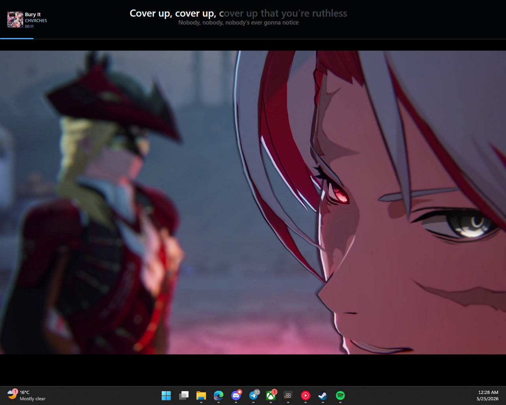

<h1> Lyrictified</h1>

A Windows desktop app that displays real-time synced lyrics for whatever music is currently playing on your system. Works with any media player that integrates with Windows media controls (Spotify, YouTube Music, foobar2000, etc.).



## Features

- Detects the currently playing song from any Windows media app via the SMTC API
- Fetches time-synced lyrics from [lrclib.net](https://lrclib.net) with a fallback to the [`syncedlyrics`](https://github.com/moehmeni/syncedlyrics) Python CLI (supports NetEase, Megalobiz, and more)
- Three display modes:
  - **AppBar** - a full-width bar attached to the top of a monitor
  - **Windowed** - a window that displays all lyrics, apple music-like
  - **Taskbar** - a compact floating window positioned above the taskbar
- Album artwork display with song title, artist, and timestamp
- Smooth progress bar showing current playback position
- Multi-monitor support with per-mode monitor selection
- Optional next-line preview
- Lyric alignment (Left, Center, Right)
- Configurable bar height (minimum 32px, default 80px)
- Graceful no-lyrics state (fades in song title instead of error animation)
- Per-app ignore lists to exclude specific media sources
- Settings persisted to `%LOCALAPPDATA%\Lyrictified\settings.json`

## Requirements

- Windows 10 version 2004 (build 19041) or later
- [.NET 10 SDK](https://dotnet.microsoft.com/download/dotnet/10.0)

## Build

```bash
dotnet build
```

## Run

```bash
dotnet run
```

## Optional: syncedlyrics CLI

If lrclib.net does not have lyrics for a song, Lyrictified can fall back to the `syncedlyrics` Python CLI. Install it with:

```bash
pip install syncedlyrics
```

You can also set the `SYNCEDLYRICS_COMMAND` environment variable to point to a custom executable.

## Project Structure

```
DisplayModes/     Layout constants for AppBar and Taskbar modes
Interop/          Win32 P/Invoke for App Bar registration and multi-monitor
Models/           SongInfo, LyricLine, DetectedMediaAppInfo
Services/         Media session watching and lyrics fetching
Settings/         App settings model and persistence
Styling/          Window appearance management
ViewModels/       MVVM view model driving the UI
```

## Credits

Built with help from:

- [OpenAI Codex](https://openai.com/codex/)
- [OpenCode](https://opencode.ai/) with [GLM-5.1](https://modelscope.cn/models/ZhipuAI/GLM-5.1) and [Kiwi](https://lucidityai.app/)
- [Google Antigravity](https://antigravity.google/product/antigravity)
- [Claude Code](https://code.claude.com/docs/en/overview)
- [Cursor](https://www.cursor.com/)
- [cotunjr](https://github.com/cotunjr)
